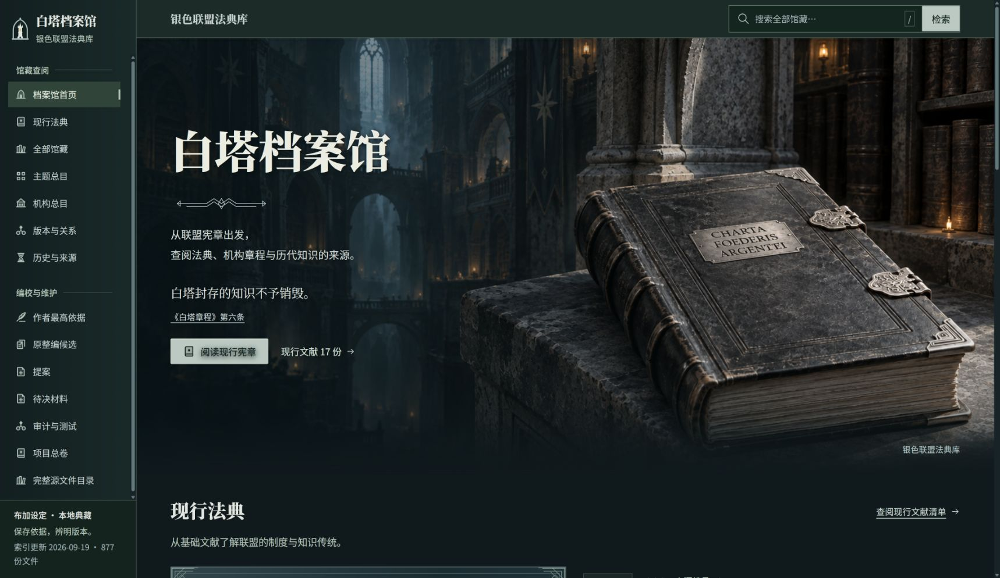
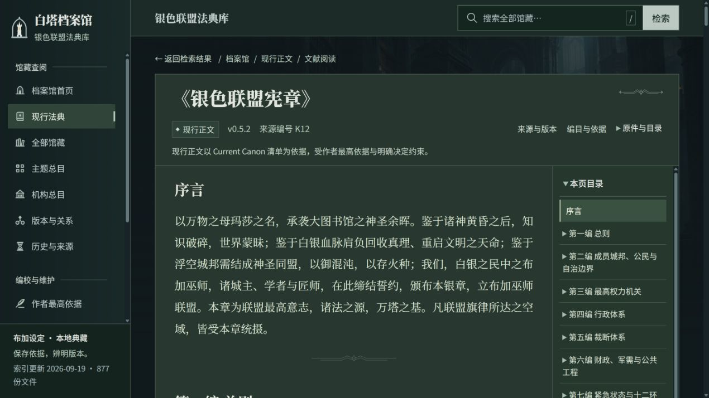

# 白塔档案馆 · 银色联盟法典库

**一座可以检索、连续阅读并追溯来源的布加设定档案馆。**

[在线阅读](https://gyjdb.github.io/buga-setting/) · [现行法典](https://gyjdb.github.io/buga-setting/#/browse?status=CURRENT_CANON) · [主题总目](https://gyjdb.github.io/buga-setting/#/topics) · [报告问题](https://github.com/gyjdb/buga-setting/issues)

这里保存银色联盟的制度、法律、魔法、财政、军事与学术机构设定，也保留候选稿、旧版本、作者依据和编校记录。你可以从一份宪章开始阅读，沿着主题、机构和来源关系继续探索。

本项目是基于《琥珀之剑》的**非官方衍生整理与创作**，包含个人扩写及经作者筛选、修改的 AI 辅助文本，不代表原作官方设定。网站中的“现行”指本项目自己的设定状态。



## 从哪里开始

- **第一次来**：从首页的《银色联盟宪章》《白塔章程》或魔法体系进入。
- **查一个概念**：使用全站搜索，或在主题、机构总目中缩小范围；结果支持状态筛选、排序和匹配片段。
- **读一份文献**：目录定位章节，资料区查看版本、适用限制、来源和原件下载。
- **比较新旧**：通过“版本与关系”查看明确记录的现行正文、历史候选及修订记录。
- **了解形成过程**：查看作者依据、提案、待决材料、审计与测试。未决内容不会被界面展示自动变成已确认设定。



## 文献状态与阅读边界

| 界面状态 | 含义 |
| --- | --- |
| 现行 `CURRENT_CANON` | 由现行清单的路径、版本与 SHA256 明确选定的文献 |
| 作者依据 `AUTHOR_CANON` | 作者直接确定的基础设定与决定，保留各自适用范围 |
| 原整编候选 `CANDIDATE` | 保留的历史候选快照，不表示新的待晋升稿 |
| 提案 / 待决 `PROPOSAL` / `UNRESOLVED` | 尚未确定或仍待作者处理的材料 |
| 历史 `SUPERSEDED` | 被后续现行正文替代，仍可追溯的旧版 |
| 参考 `REFERENCE` | 来源、修订、审计及辅助资料，本身不等于现行正文 |

作者明确依据优先于现行制度文本；世界内法律位阶与项目内作者权威是两个层面。`DELEGATED_DESIGN` 保留原有授权设计登记含义。**Archive 是馆藏展示语境，不是新增状态。**

主题和机构入口用于查找文本提及，不推断机构隶属。项目日期、文件修改时间不是世界内颁布日期。没有定位到的原文引用如实标注，不用近似名称补造来源。

## 技术与本地运行

这是纯静态网站：Python 在构建时生成 Markdown 正文、JSON 索引与原件副本，浏览器用原生 JavaScript 和 Web Worker 完成搜索、筛选和阅读。**GitHub Pages 可以完整承载，不需要数据库、在线 Python 服务或账号登录。**

需要 Python 3.10+；Node.js 仅用于运行搜索与前端检查。

```bash
git clone https://github.com/gyjdb/buga-setting.git
cd buga-setting
python -m pip install -r tools/library_portal/requirements.txt
python tools/library_portal/fetch_fonts.py
python tools/library_portal/build.py
python tools/library_portal/verify.py
python tools/library_portal/verify_publication.py
python -m http.server 8765 --bind 127.0.0.1 --directory site/library_portal
```

打开 [本地预览：127.0.0.1:8765](http://127.0.0.1:8765/)。不要双击 `index.html`，`file://` 无法正常读取索引和启动搜索 Worker。

首次准备需要联网安装依赖及获取字体。字体按固定版本下载并核验 SHA256，构建后随站点提供；访客不访问字体 CDN，也不依赖电脑已安装字体。准备完成后可离线重建和通过本地 HTTP 服务阅读，也可将整个 `site/library_portal/` 复制到另一台电脑使用。

### 检查与更新

```bash
python tools/library_portal/build.py
python tools/library_portal/verify.py
python tools/library_portal/verify_publication.py
node tools/library_portal/test_search.cjs
node tools/library_portal/test_frontend.cjs
```

构建只写入 `site/library_portal/`，不编辑 `organized_project/`。检查覆盖原件哈希、现行清单、版本配对、索引完整性、内部链接、正文安全渲染和搜索行为；不代替世界观内容的人工审查。

修改前端后重建即可。更新设定需遵循作者确认与版本登记流程，不能仅因目录或版本号提升状态。`docs/public-source-manifest.json` 记录公开快照的原始字节哈希；后续正式更新时需维护清单，检查会拒绝未登记变化。

## GitHub Pages 部署

仓库自带[发布工作流](.github/workflows/pages.yml)。仓库所有者首次在 **Settings → Pages → Build and deployment → Source** 选择 **GitHub Actions**；之后推送 `main` 会构建、检查并发布到：

[白塔档案馆 · 在线阅读](https://gyjdb.github.io/buga-setting/)

Pull Request 只执行检查，不发布。部署产物只有生成站点，不包含工作目录、Git 历史或本地运行脚本。页面使用 `#/…` 路由和相对资源路径，支持 GitHub 项目子目录；分享文献链接后可直接打开，也可刷新。

首次启用后如需重新发布，在 **Actions → Build and publish archive → Run workflow** 手动运行。应同时确认 Actions 部署成功与实际网址可访问。

## 仓库结构与公开范围

```text
organized_project/          # 公开的设定、作者依据、候选、旧版与编校材料
archive/                    # 原根目录早期文件、历史 HTML 展示及迁移索引
tools/library_portal/       # 只读构建器、校验与搜索测试
  web/                     # 正式前端、场景、定稿 SVG 图标与字体许可
  fetch_fonts.py           # 固定来源、SHA256 校验的字体准备
docs/                      # 公开范围、来源清单、项目截图
.github/workflows/pages.yml # 构建、检查与 Pages 发布
site/library_portal/       # 本地生成结果，不提交到 Git
```

公开版保留全部现行正文及必要的作者依据、历史版本和审计记录，**不等于本地迁移工作区的完整备份**。原始聊天导出、账号/项目容器元数据、工具缓存、第三方技能、旧设计样板和历史门户代码快照未发布。部分文献引用本地保留的原始资料；这些引用保留原义，未冒充公开可查。

详细范围见 [PUBLICATION.md](docs/PUBLICATION.md)。数量由当前构建数据计算，不在介绍中维护容易过期的手填计数。

早期散落在根目录的法规与 HTML 展示已整理到 [archive/](archive/README.md)，并提供旧路径对照；与待决材料逐字节相同的副本已去重，原件继续保留。归档不改变状态或权威，也不重复加入站点索引。请通过站内现行清单判断版本。

## 视觉、字体与许可

页面使用石构藏书空间、深色装帧与哑银的视觉方向。场景图是 AI 辅助创作的概念演绎，不证明世界内存在对应建筑、徽章或历史事件；没有搬用参考网站的角色、标志或场景。图标采用作者提供的定稿 B 组馆标和 v3 主题／导航 SVG。

| 角色 | 字体与真实字重 |
| --- | --- |
| 中文馆名、文献题名 | 思源宋体 SC，900 |
| 中文长篇正文 | 思源宋体 SC，400 |
| 导航、按钮、目录、资料字段 | 思源黑体 SC，400 / 500 |
| 英文展示 / 阅读 | Source Serif 4，600 / 400 |

字体来源、固定版本与哈希见 [SOURCES.json](tools/library_portal/web/fonts/SOURCES.json)。中文字体使用真实可变字重，禁用伪粗体。完整字体文件较大，慢速网络首次加载可能需要片刻，之后可由浏览器缓存。

项目代码、原创界面与维护者有权授权的原创材料采用 **[MIT License](LICENSE)**。思源宋体、思源黑体与 Source Serif 4 保留 **SIL Open Font License 1.1**，详见 [THIRD_PARTY_NOTICES.md](THIRD_PARTY_NOTICES.md)。

《琥珀之剑》及其原作名称、人物、组织、术语和世界观元素的权利仍归原作者或相应权利人；MIT 不将这些第三方内容重新授权。本项目供非官方整理、交流与创作讨论使用。

## 反馈与贡献

欢迎提交 Issue，附上页面链接、文献版本、预期与实际表现。文字或设定建议请说明依据及影响范围；未获作者确认的建议保持提案身份。前端贡献请运行上述检查，并检查手机阅读、键盘焦点与来源入口。

维护者：**Ethan / [gyjdb](https://github.com/gyjdb)**。
